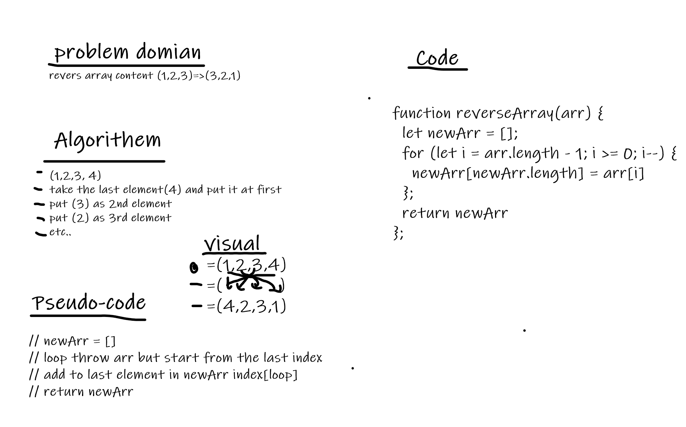

# # Reverse an Array

## Whiteboard Process

## Approach & Efficiency

I use drawing a whiteboard and solve problem by cutting it to small parts, I tested the method I wrote on the given output and it gives the desired result, it took me about  hour to solve the problem.