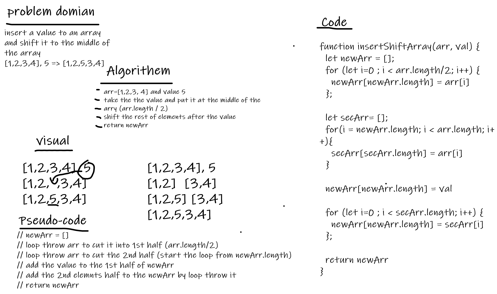

# array-insert-shift.
 - A function that removes an element from the middle index and shifts other elements in the array to fill the new gap.

## Whiteboard Process

## Approach & Efficiency

- I use drawing a whiteboard and solve problem by cutting it to small parts, I tested the method I wrote on the given output and it gives the desired result, it took me about 2 hour to solve the problem.