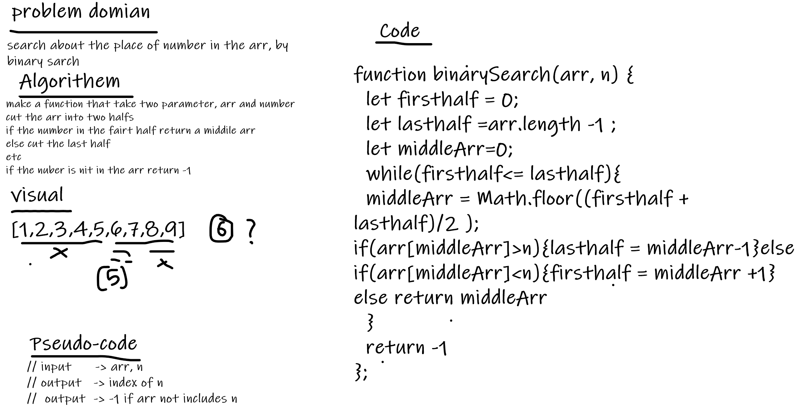

# binary Search.
 - A function that finds an index of number if it included in th array. Otherwise, the function will return -1.

## Whiteboard Process

## Approach & Efficiency

- I use drawing a whiteboard and solve problem by cutting it to small parts, I tested the method I wrote on the given output and it gives the desired result, it took me about 3 hour to solve the problem.