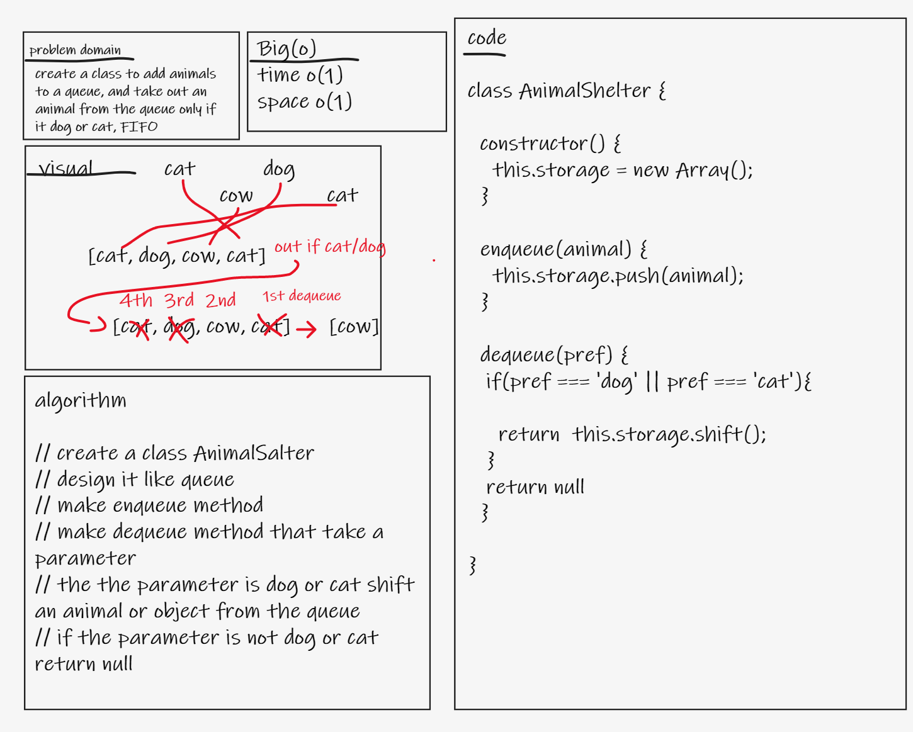
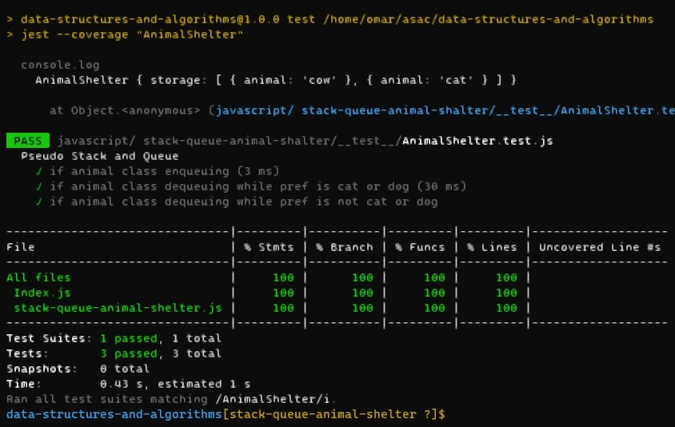

# First-in, First out Animal Shelter.

- create a class to add animals to a queue, and take out an animal from the queue only if it dog or cat, FIFO.

## Whiteboard Process

## Approach & Efficiency
- I made queue using `Class` and name it AnimalShelter.
    - space O(1)
    - time O(1)

## Solution
- **test**: `npm test AnimalShelter`

