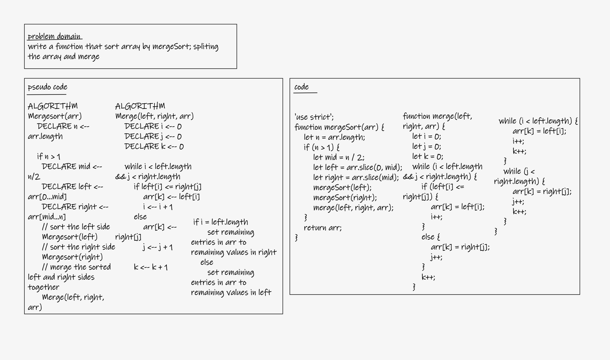
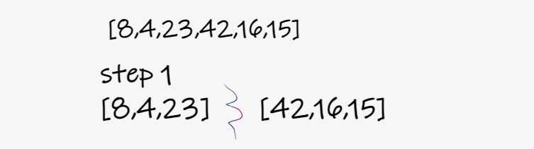
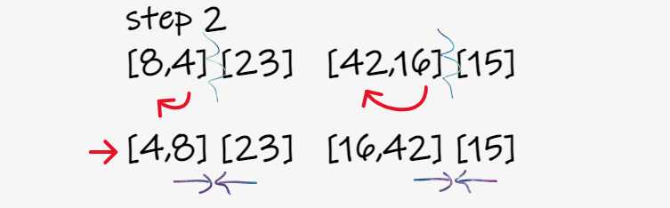
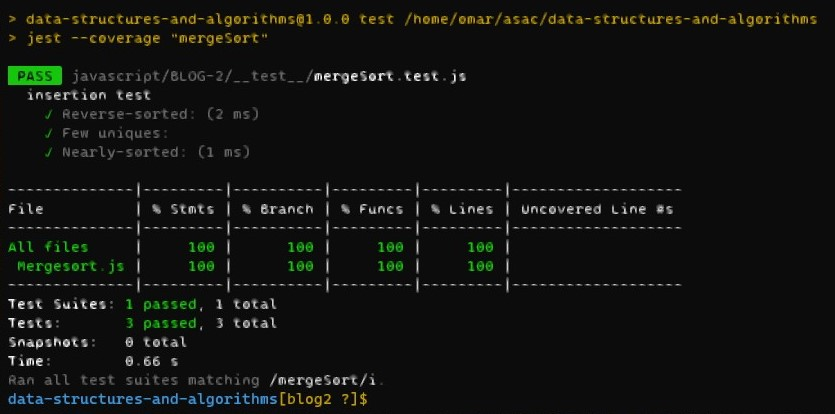

# Merge Sort

- Review the pseudocode below, then trace the algorithm by stepping through the process with the provided sample array. Document your explanation by creating a blog article that shows the step-by-step output after each iteration through some sort of visual.

## BLOG and Whiteboard

- **Whiteboard**

  - 

- **BLOG 'visual'**

  - 
    - Split the array from the middle; rite array and lift array 
  - 
    - Split the rite and the lift array; for each array sort the element, the smallest to the biggest. Then merge the rite arrays and the lift arrays again.   
  - 
    - After the two sides have been marged, marge the lift and the rite arrays to be one array again. 
  - 
    - the merge will be completed after the array's elements are being sorted from the smallest to the biggest. 

  - big(O)
    - Time: O(n \* log(n))
    - Space: O(n \* log(n))

## solution 'test

- `npm test margeSort`
- 
