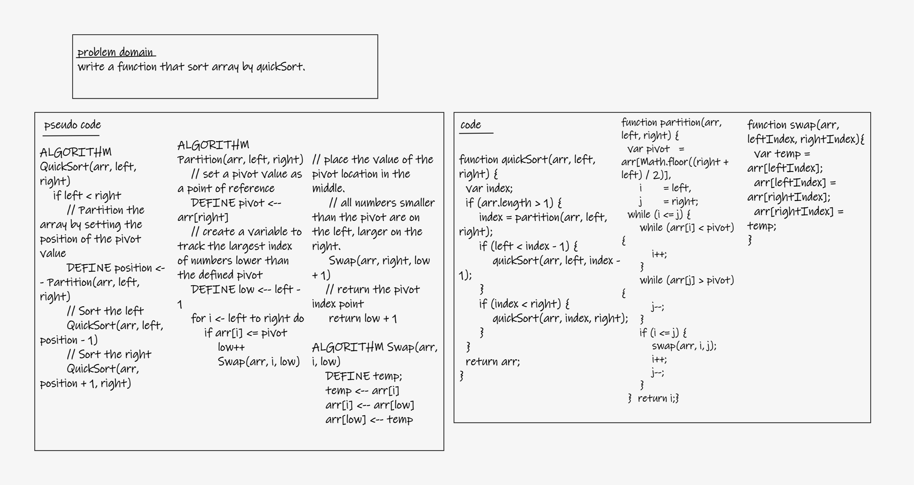
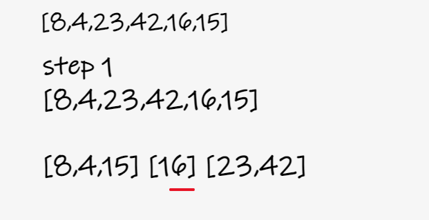
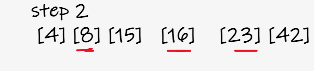
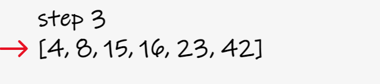
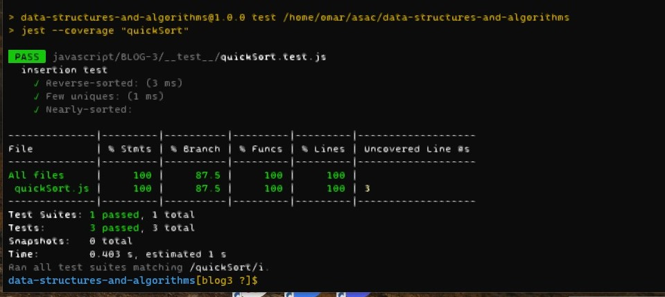

# Quick Sort

- Review the pseudocode below, then trace the algorithm by stepping through the process with the provided sample array. Document your explanation by creating a blog article that shows the step-by-step output after each iteration through some sort of visual.

## BLOG and Whiteboard

- **Whiteboard**

  - 

- **BLOG 'visual'**

  - 
    - select the Pivot which is the middle number in array. Then but the larger numbers in a right array and the smaller in a left array
  - 
    - repeat the previous step to the right and the left array. but keep the first pivot the same palace or index 
  - 
    - the numbers now are sorted, return them in array
   

  - big(O)
    - Time: O(n \* log(n))
    - Space: O(n \* log(n))

## solution 'test

- `npm test quickSort`
- 
