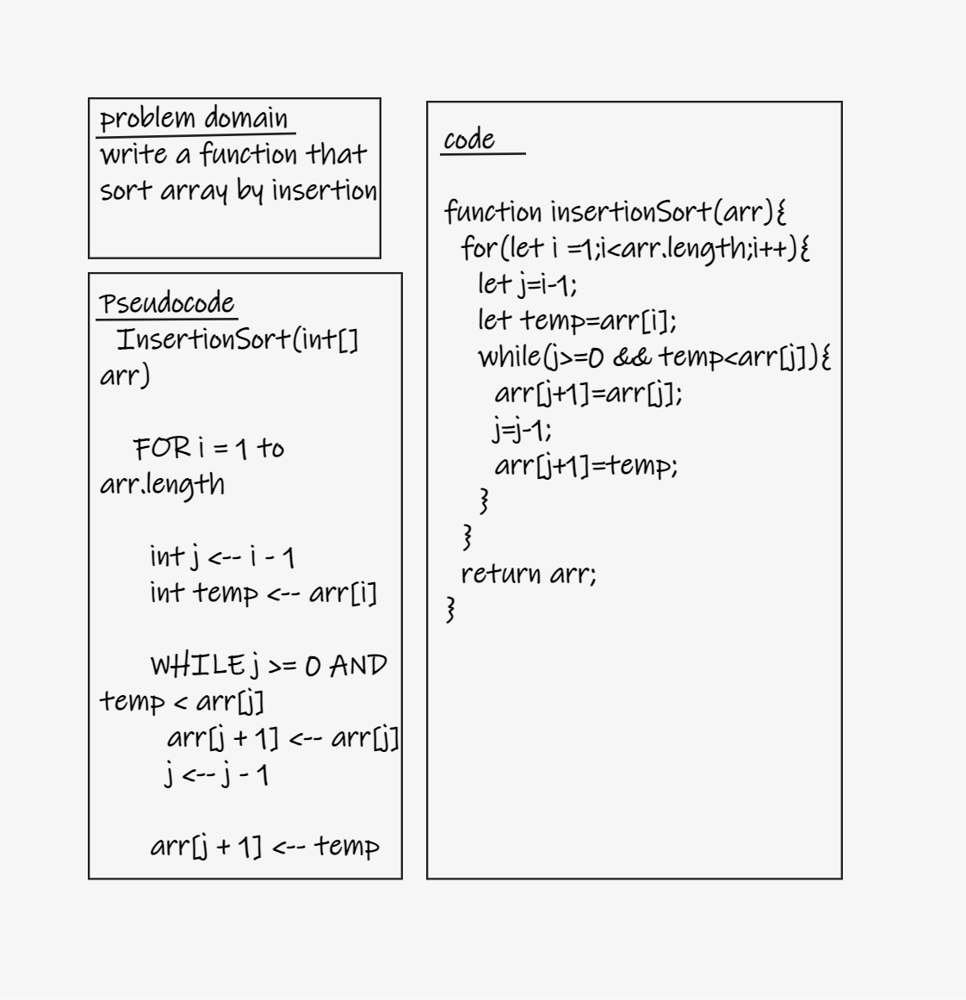
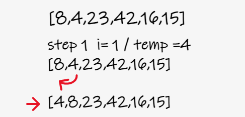
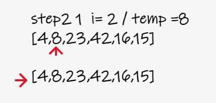
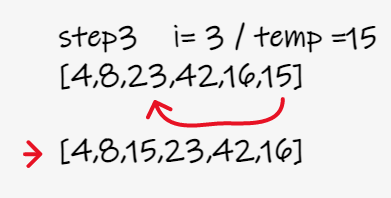
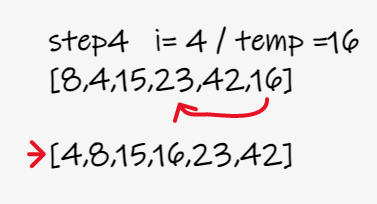
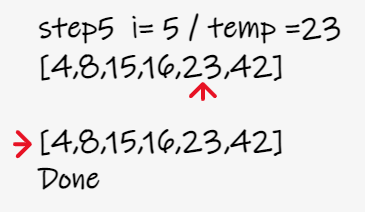
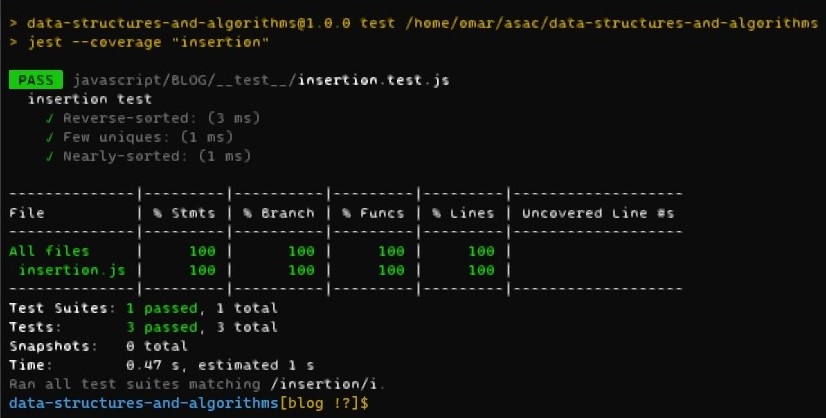

# Insertion Sort

- Review the pseudocode below, then trace the algorithm by stepping through the process with the provided sample array. Document your explanation by creating a blog article that shows the step-by-step output after each iteration through some sort of visual.

## BLOG and Whiteboard

- Whiteboard

  - 

- BLOG 'visual'
  - 
    - the smallest number in the array well move to the the first index.
  - 
    - the temp is 8 so it is smaller than the rest of the array's numbers, it will not be swapped.
  - 
    - search for other number smaller than the rest if the array's numbers and swap it after the last temp index
  - 
    - search for other number smaller than the rest if the array's numbers and swap it after the last temp index
  - 
    - the array is sorted from the smallest to the biggest number
  - big(O)
    - time: O(n^2)
    - space: O(1)

## solution 'test

- `npm test insertion`
- 
