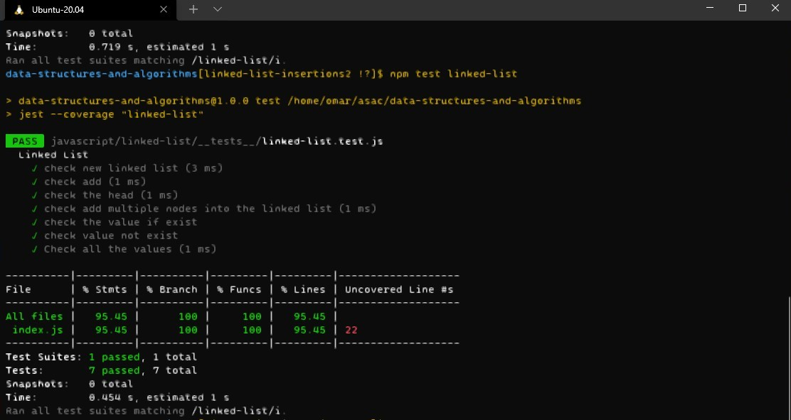
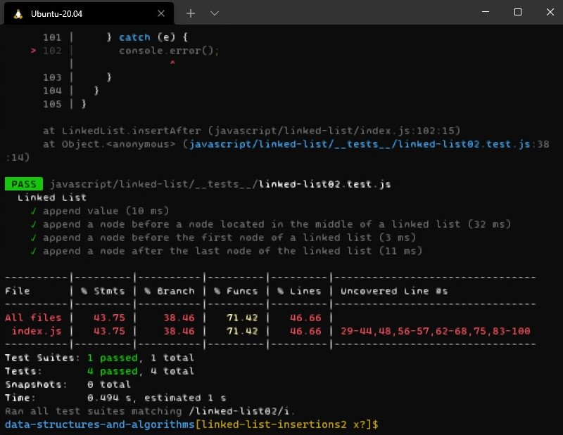

# Singly Linked List
single linked list that make object an node inside it 

## Challenge
create a single linked list with that append head, if the head is empty add node 
add to next node if empty
etc ..

## For test
- `npm test linked-list`

- `npm test linked-list02`

## First implementation result
 

## Second implementation result
 

## Approach & Efficiency
using `Class` to create Node and to create linkedList
    > Big(1)

## API
1. `insert method`: if the the head is null add the new value to new node, otherwise add the new value to next node 
2. `includes method`: if the value is in the linked list or note (return boolean)
3. `toString method`: stringify the linked list and re turn it as `'value --> nextValue --> null'`
---
4. `insertBefore`: insert a node before the head; if the head is empty it will create a node.
5. `insertAfter`: insert a node after the last node in the linked list 
