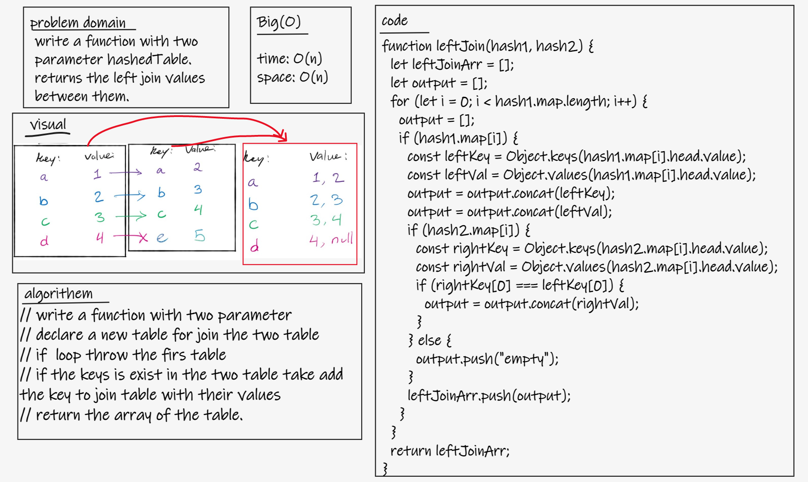
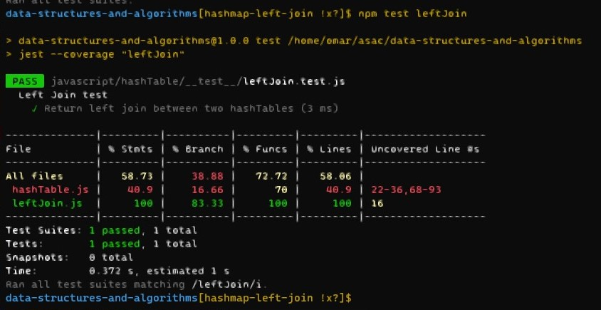

# Challenge
- write a function with two parameter hashedTable. returns the left join values between them. 
## Whiteboard Process
- 

## Approach & Efficiency
- time o(n)
- space o(n)

## Solution
- `npm test leftJoin`
