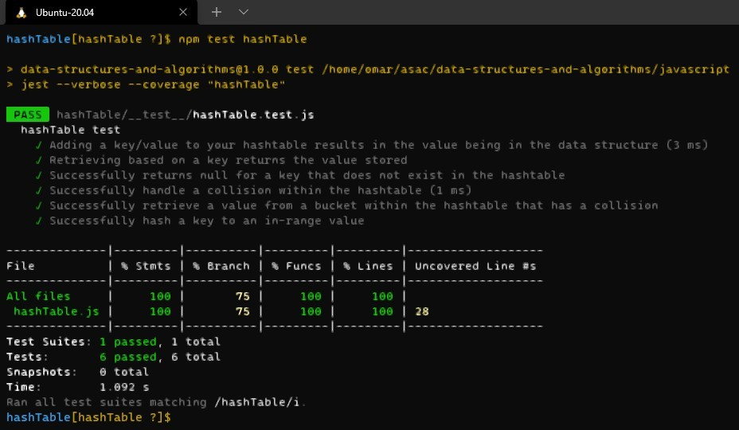

# Hashtables
- Hashing is a technique that is used to uniquely identify a specific object from a group of similar objects

## Challenge
- create a hash table with methods; add, get, contain and hash

- **test**
  - npm test hashTable
  - 

## Approach & Efficiency
- Big(o)
  - Time: O(1)
  - Space: O(1)

## API
- `add()`: Arguments: key, value, Returns: nothing.
  - This method should hash the key, and add the key and value pair to the table, handling collisions as needed.
- `get`: Arguments: key, Returns: Value associated with that key in the table
- `contains`: Arguments: key, Returns: Boolean, indicating if the key exists in the table already.
- `hash`: Arguments: key, Returns: Index in the collection for that key