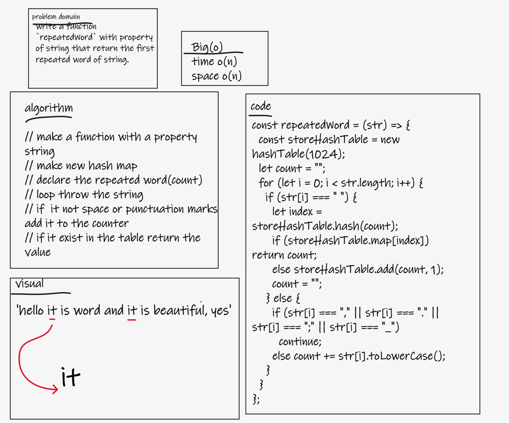
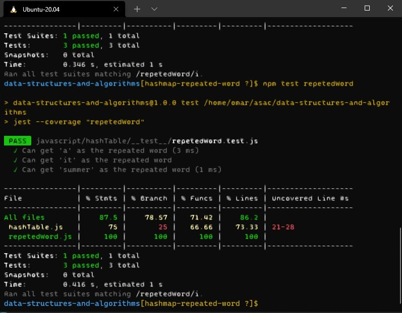

# Challenge hashmap-repeated-word

## Challenge 
- write a function `repeatedWord` with property of string that return the first repeated word of string.

## For test
- `npm test repetedWord`

## whiteboard
-  

## implementation result
- 