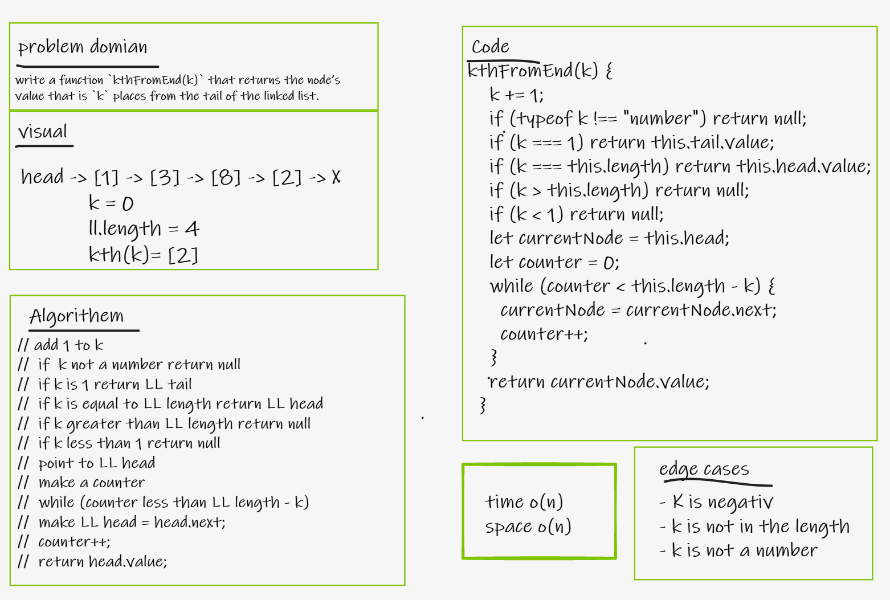
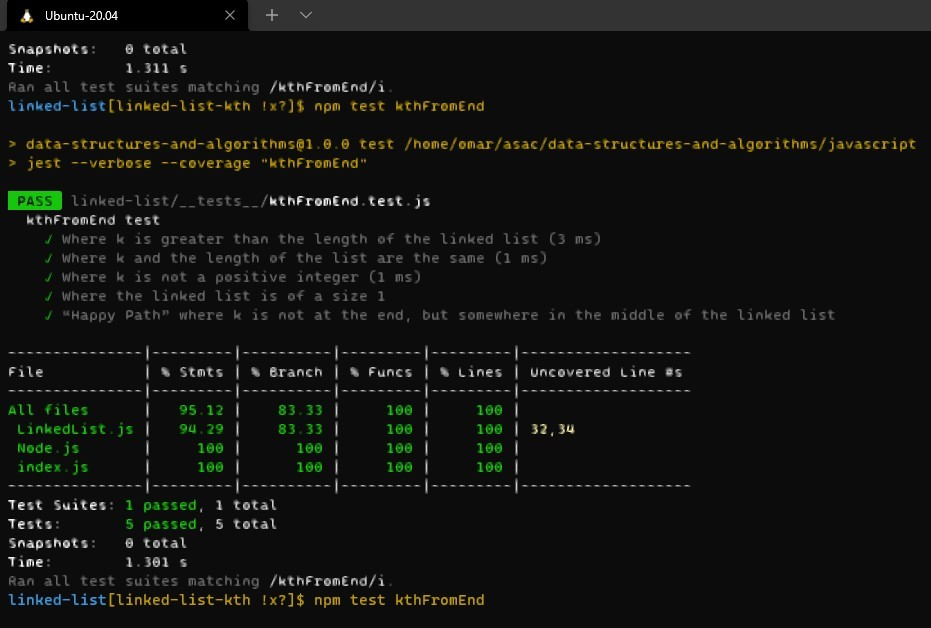

# Linked List

## Challenge 
- write a function `kthFromEnd(k)` that returns the node’s value that is `k` places from the tail of the linked list.

## For test
- `npm test kthFromEnd`

## whiteboard
-  

## implementation result
- 