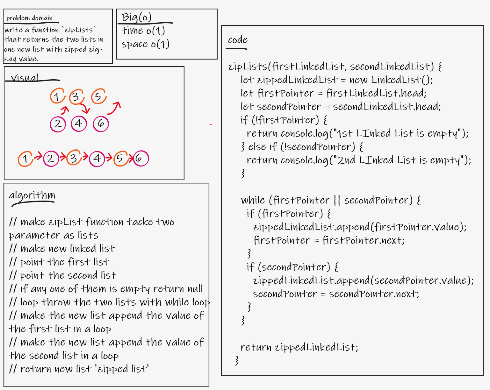
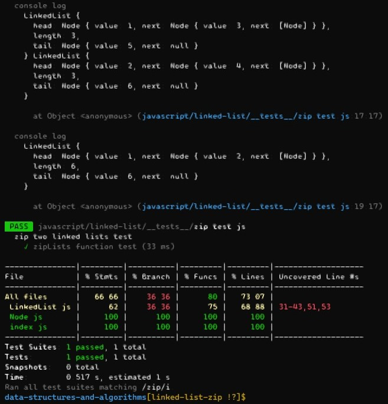

# zip Linked List

## Challenge 
- write a function `zipLists` that returns the two lists in one new list with zipped zig-zaq value.

## For test
- `npm test zip`

## whiteboard
-  

## implementation result
- 