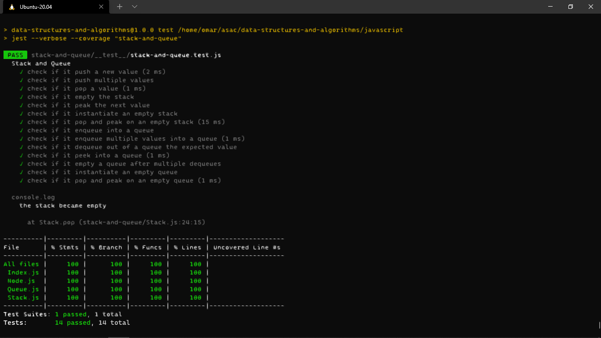

# Stacks and Queues
- create a stack with push, pop, peak and isEmpty methods and test it.
- create a queue with enqueue, dequeue, peak and isEmpty methods and test it.

## Challenge
- create a stack and a queue and test all the methods 100%
- **test**: `npm test stack-and-queue`

## Approach & Efficiency
- I made the stack and the queue using `Class` to understand the concept.
    - space O(1)
    - time O(1)

## API
**Stack**
- `Push`: Nodes or items that are put into the stack are pushed
- `Pop`: Nodes or items that are removed from the stack are popped. When you attempt to pop
- `Peek`: When you peek you will view the value of the top Node in the stack. When you attempt to peek an empty stack an exception will be raised.
- `IsEmpty`: returns true when stack is empty otherwise returns false.
***
**Queue**
- `Enqueue`: Nodes or items that are added to the queue.
- `Dequeue`: Nodes or items that are removed from the queue. If called when the queue is
- `Peek`: When you peek you will view the value of the front Node in the queue. If called when the queue is empty an exception will be raised.
- `IsEmpty`: returns true when queue is empty otherwise returns false.