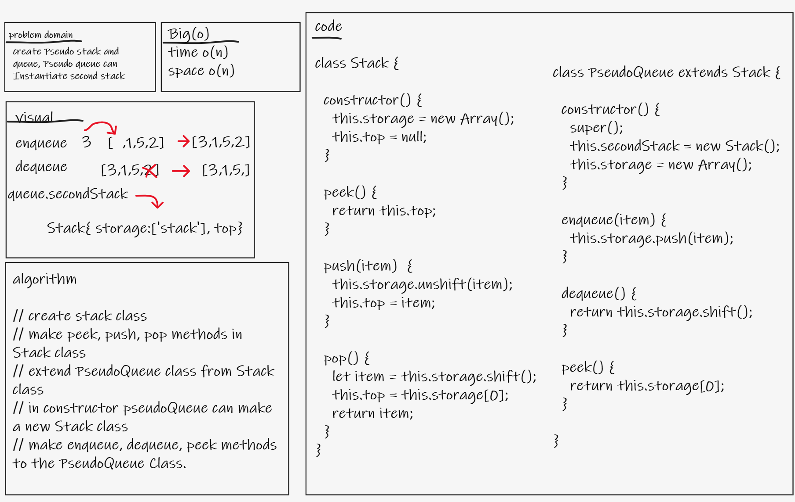
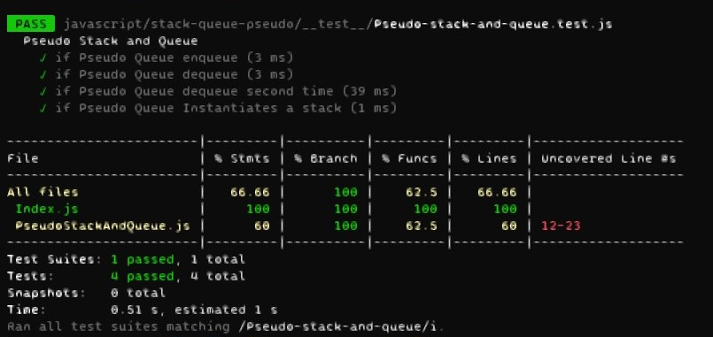

# Stacks and Queues

- create Pseudo stack and queue, Pseudo queue can Instantiate second stack

## Whiteboard Process

## Approach & Efficiency
- I made the stack using `Class` and `array` then extends queue from stack.
    - space O(n)
    - time O(n)

## Solution
- **test**: `npm test Pseudo-stack-and-queue`

