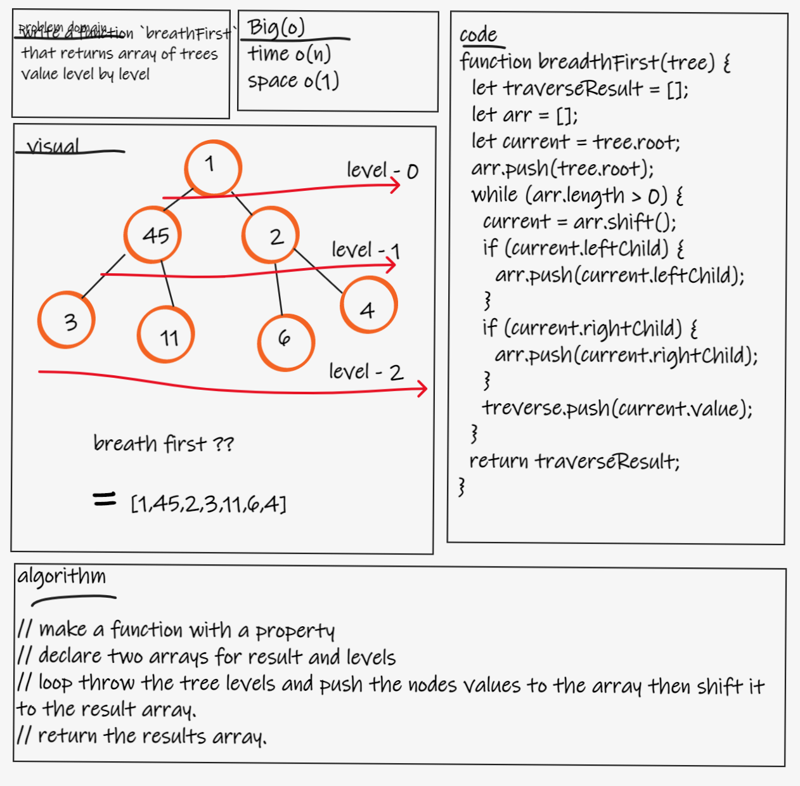
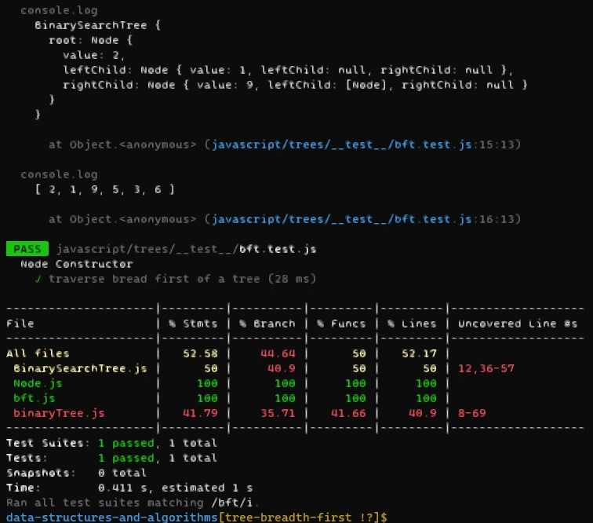

# Challenge Summary
- write a function `breathFirst` that returns array of trees value level by level.

## Whiteboard Process

## Approach & Efficiency
- time o(n)
- space o(1)

## Solution
- `npm test bft`
- 