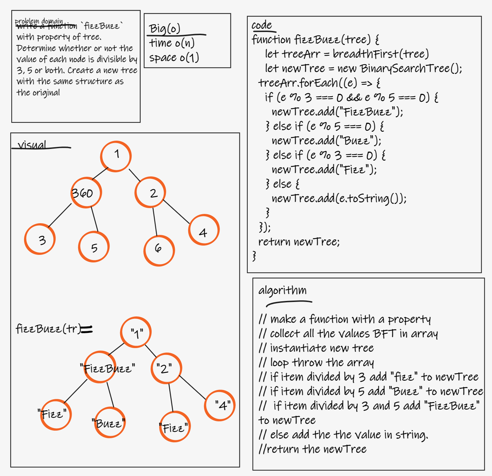
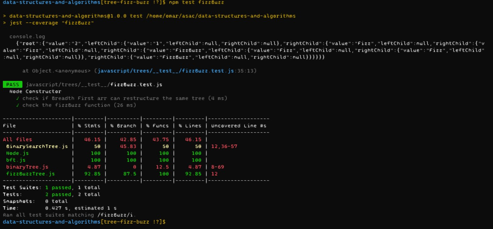

# Challenge Summary
- write a function `fizzBuzz` with property of tree. Determine whether or not the value of each node is divisible by 3, 5 or both. Create a new tree with the same structure as the original

## Whiteboard Process

## Approach & Efficiency
- time o(n)
- space o(1)

## Solution
- `npm test fizzBuzz`
- 