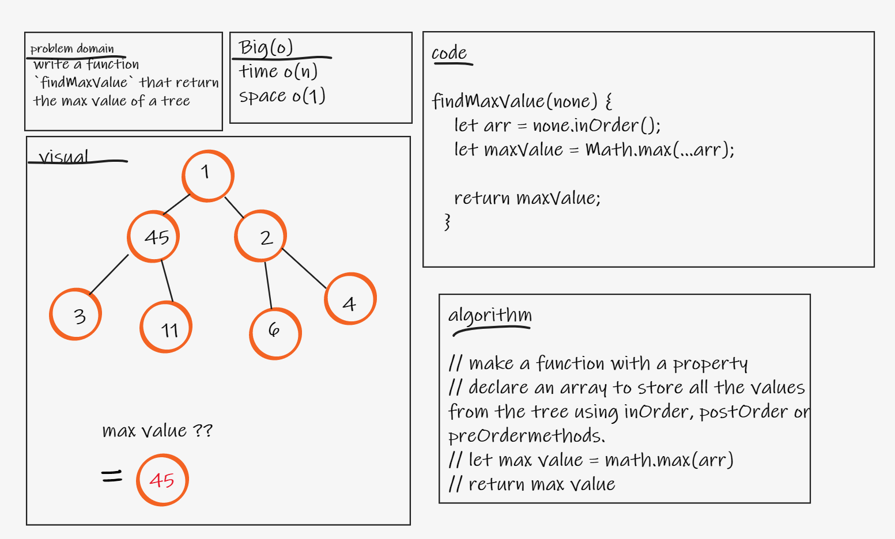
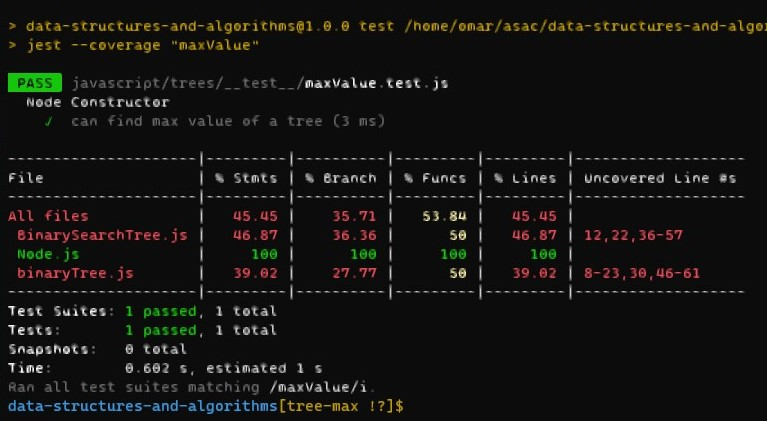

# Challenge Summary
write a function `findMaxValue` that return the max value of a tree

## Whiteboard Process

## Approach & Efficiency
- time o(n)
- space o(1)

## Solution
- `npm test maxValue`
