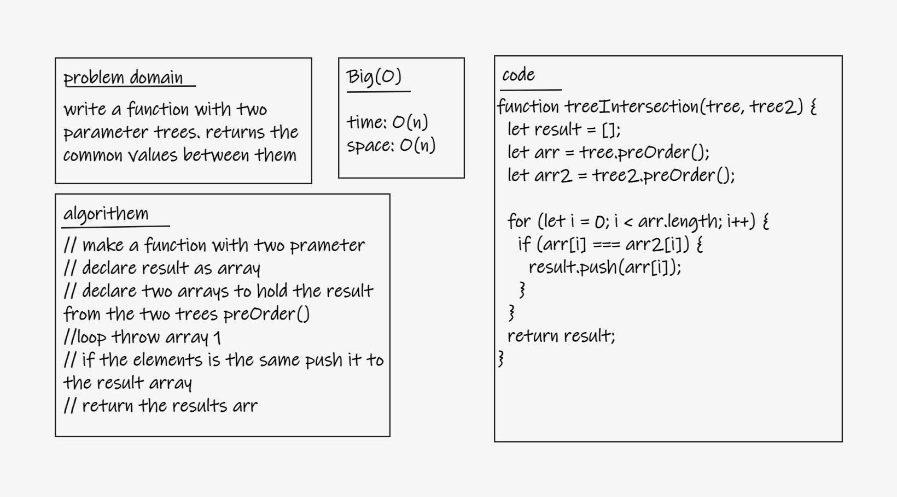

# Challenge
- write a function with two parameter trees. returns the common values between them
## Whiteboard Process
- 

## Approach & Efficiency
- time o(n)
- space o(n)

## Solution
- `npm test treeIntersection`
