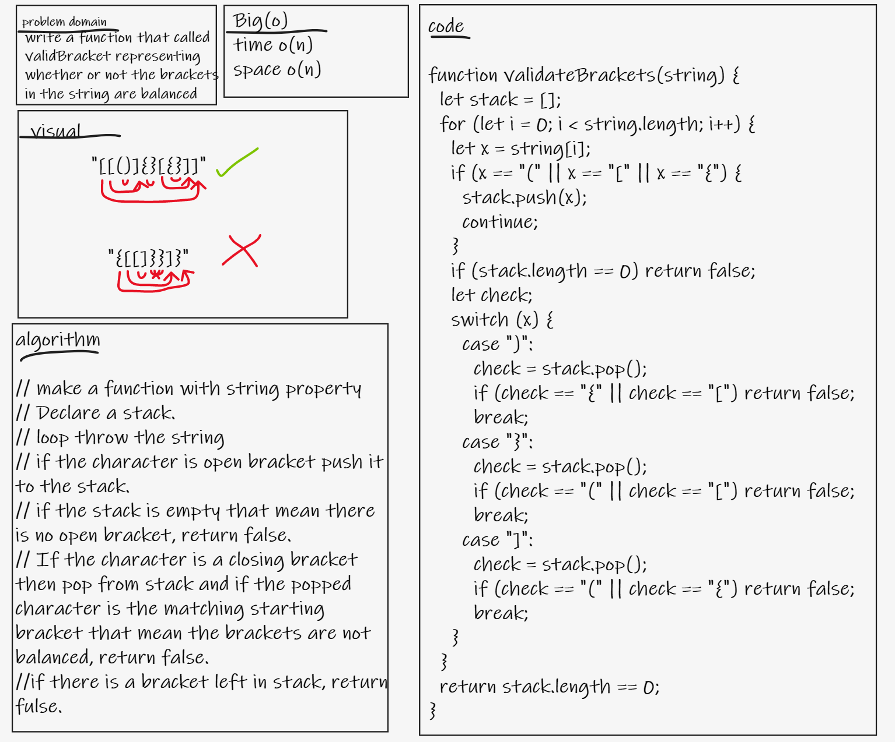
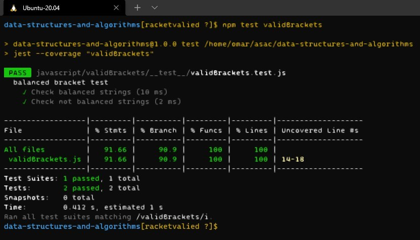

# Stacks and Queues

- write a function that called validBracket representing whether or not the brackets in the string are balanced

## Whiteboard Process

## Approach & Efficiency
    - space O(n)
    - time O(n)

## Solution
- **test**: `npm test validBrackets`

